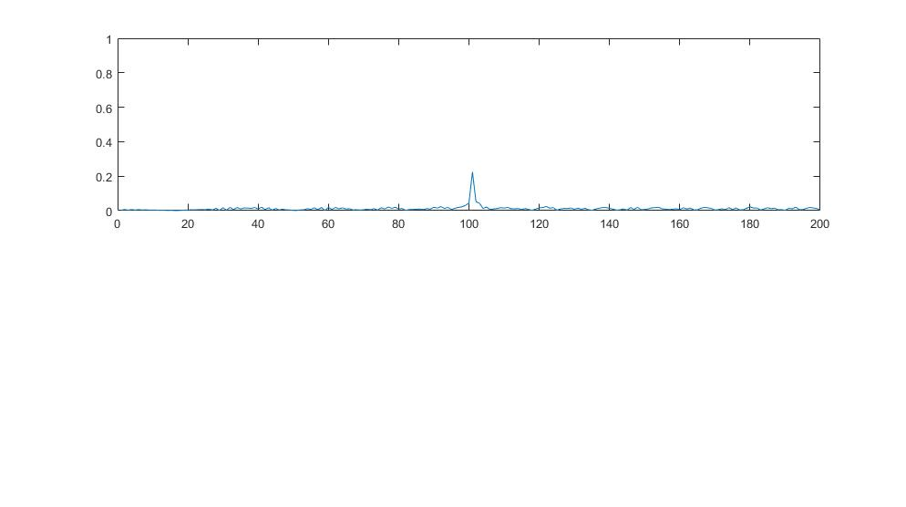
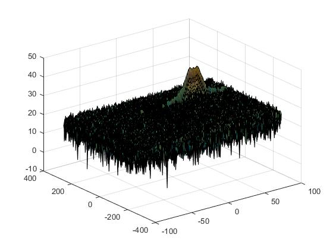
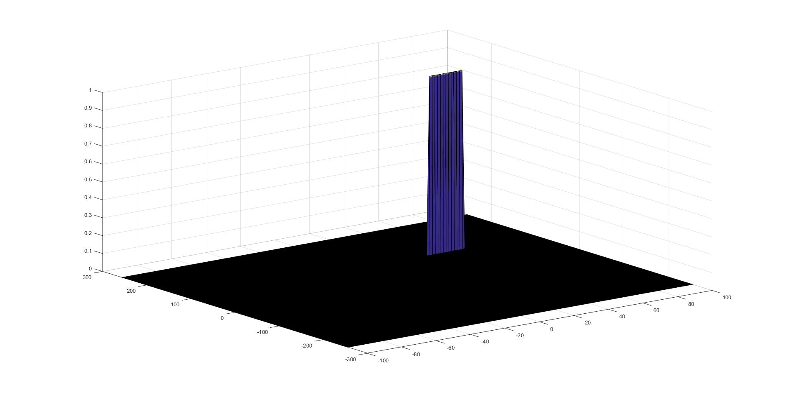

# Radar Target Generation and Detection

This document gives a brief explenation about the steps taken for solving the 2D CFAR problem within the radar target detection project. 

## 1. Implemenation steps for the 2D CFAR process
First, implementing the parameters for the number of training and guard cells for both range and doppler dimension has been done. Also, the offset paraemter was defined. The core of the 2D CFAR approach is a nested for loop which iterates over every single CUT within the range doppler matrix. The indecies i and j are used to reference the respective CUT. Another 2 dimensional for loop (with parameters p and q) is being used to define and iterate through a surrounding window (comprising of both training and guard cells) for every single CUT iteration. Withing this loop structure, a noise value is being calculated by summing up for all training cell matrix entries. Once all training cells have been considered, the threshold is being defined by normalizing the noise and adding an offset. Ultimately, the (noise) threshold is being used to compare the current CUT against it. If the CUT exceeds the threshold (i.e. we consider it to be a target match), a binary flag is being set in the CFAR_Map. Otherwise, we consider the CUT to be noise and filter it out by assigning a value of 0 in the CFAR_Map.    

The corresponding Matlab implementation is shown below. More detailed explanation can be found in the comments. 

## 2 Selection of Training, Guard Cells and Offset
In this specific use case, there's only one target. Therefore, the number of training cells can be rather high. After choosing buest guesses for the intial values, I tweaked the paramers once the implementation was finalized. I reduced the number of charps and samples, so I could speed up the testing. 

I ended up with the following values:
- Tr = 8
- Td = 8
- Gr = 4
- Gd = 4
- offset = 10

## 3 Supress the non-thresholded cells at the edges

I was using a dedicated CFAR (binary) map, which has been initialized with 0 values. Therefore, the values on the boundaries didn't have to be filtered out.

## Results
The radar detection pipeline was tested with an an initial target position of 100 m and a target velocity of 50 m/s. The corresponding plots are shown below. 

